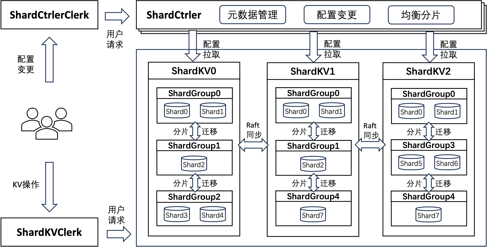

# ShardKV实现

基于mult-raft架构，实现数据的分片、迁移等操作。

## 总体设计

如下图给出了ShardKV的总体架构图：

简要介绍一下图中每部分的作用：
* ShardCtrler，集群的配置中心，负责分片分布，raft组位置等元数据的管理。
* ShardCtrlerClerk，通过ShardCtrlerClerk，用户能向配置中心ShardCtrler发送分片迁移、分片均衡和新增加raft组等功能
* ShardKVClerk，用户通过此客户端发送所需的KV请求
* Shard，数据分片，用于存储部分数据和处理部分KV请求
* ShardGroup，一个ShardGroup管理若干个Shard，主要负责转发KV请求，不同Group中的分片迁移以及通过raft协议维护分片服务的高可用
* ShardKV，一般对应一台实体机器，用于统一管理分布在一台机器上的所有ShardGroup

## KV操作流程

1. 用户发起请求
2. ShardGroup获得请求，调用raft日志同步，同时等待结果
3. raft完成同步后，调用ShardManger的apply方法
4. apply完成请求后，通知等待线程，将结果返回给用户

